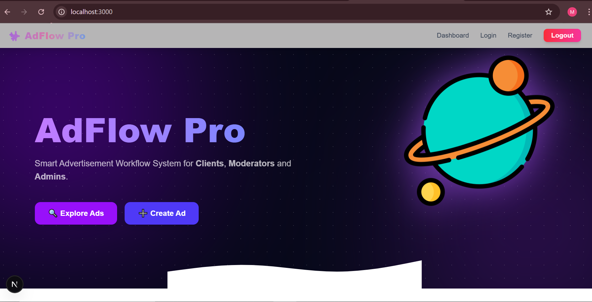
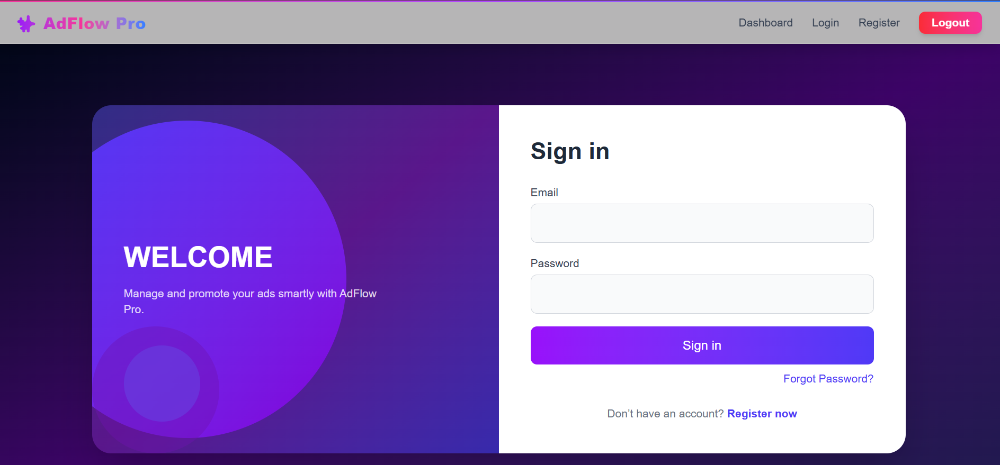
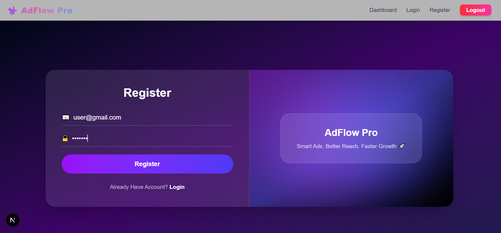
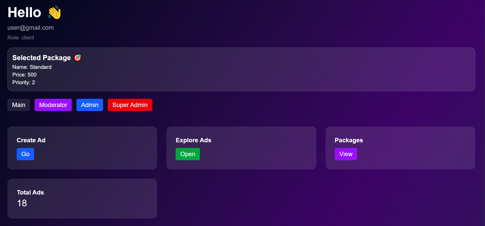
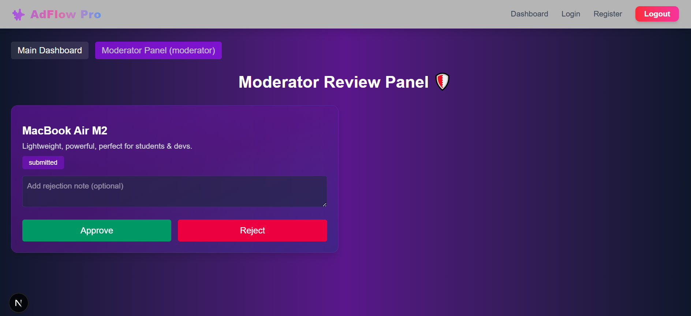
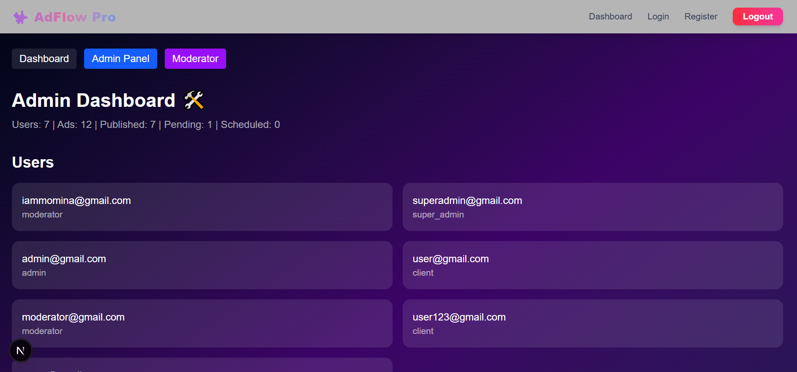
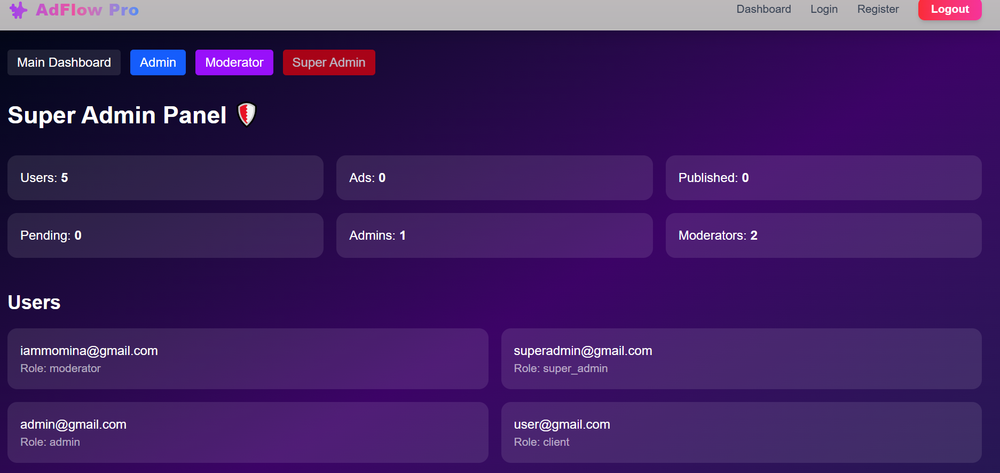

# 🚀 AdFlow Pro

AdFlow Pro is a modern **Sponsored Listing Marketplace** built using **Next.js** and **Supabase**.  
It simplifies the process of creating, managing, and promoting advertisements with a **secure, role-based, and scalable system**.

---

## 🌐 Live Demo
🔗 https://adflow-pro-ashen.vercel.app/

---

## 🖼️ Project Screenshots

### 🏠 Home Page

### 🔐 Login Page

### 📝 Register Page

### 👤 User Dashboard

### 🛠️ Moderator Panel

### 🛡️ Admin Panel

### 👑 Super Admin Panel

---

## ✨ Key Features

### 🔐 Authentication & Role-Based Access
- Secure authentication using **Supabase Auth**
- Role-based system:
  - 👤 User  
  - 🛠️ Admin  
  - 🛡️ Moderator  
  - 👑 Super Admin  
- Protected routes & dashboards

---

### 📢 Ad Management
- Create, edit & delete advertisements  
- Upload ads via image URL  
- Organized listing system  
- Real-time updates with Supabase  

---

### 🛡️ Moderation System
- Approval workflow for ads  
- Accept / reject advertisements  
- Ensures platform quality & control  

---

### ⏰ Scheduling System
- Schedule ads for future publishing  
- Auto activation based on time  
- Better campaign planning  

---

### 📊 Analytics Dashboard
- Track ad performance  
- Monitor engagement  
- Data-driven insights  

---

### 💳 Payment Verification
- Submit transaction ID  
- Upload payment proof (URL-based)  
- Admin verification before approval  

---

## 👤 Test Accounts

| Role | Email | Password |
|------|------|----------|
| 👤 User | user@gmail.com | user123 |
| 🛠️ Admin | admin@gmail.com | admin123 |
| 🛡️ Moderator | moderator@gmail.com | moderator123 |
| 👑 Super Admin | superadmin@gmail.com | superadmin123 |

---

## 🛠️ Tech Stack

### Frontend
- Next.js  
- React.js  

### Backend / BaaS
- Supabase (Auth + Database + APIs)

### Database
- PostgreSQL (via Supabase)

### Styling
- Tailwind CSS  

---

## 📁 Project Structure
adflow-pro/
│── app/
│── components/
│── lib/
│── services/
│── public/
│── styles/

---

⚙️ Installation & Setup
1️⃣ Clone Repository
git clone https://github.com/mominabukhari/adflow-pro.git

2️⃣ Navigate to Project
cd adflow-pro

3️⃣ Install Dependencies
npm install

4️⃣ Setup Environment Variables
Create a .env.local file and add:
NEXT_PUBLIC_SUPABASE_URL=your_supabase_url
NEXT_PUBLIC_SUPABASE_ANON_KEY=your_anon_key

5️⃣ Run Development Server
npm run dev

6️⃣ Open in Browser
http://localhost:3000
http://localhost:3000

---

🚀 Future Enhancements
🔔 Real-time notifications
💬 Chat system for users
⭐ Featured ads & ranking system
📈 Advanced analytics dashboard

---

🤝 Contribution
Pull requests are welcome. For major changes, please open an issue first to discuss improvements.

---

👩‍💻 Author
Developed by Momina Bukhari
